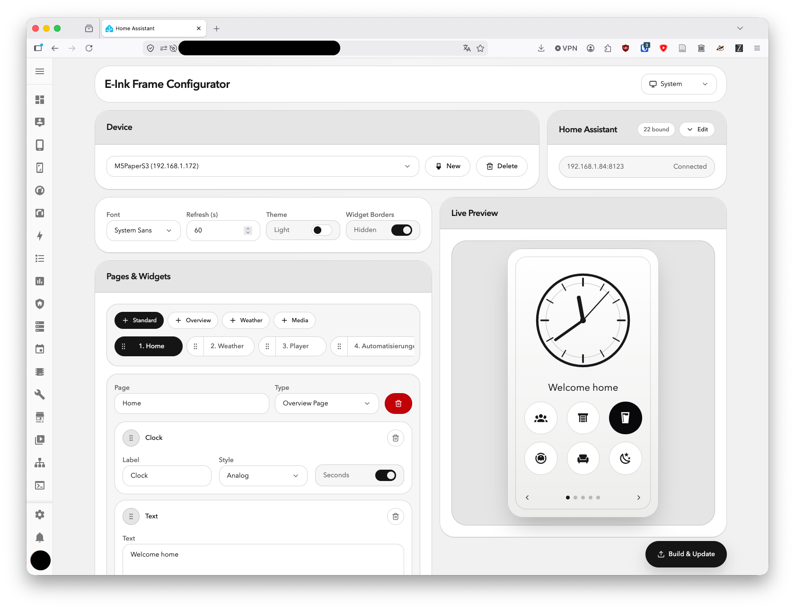
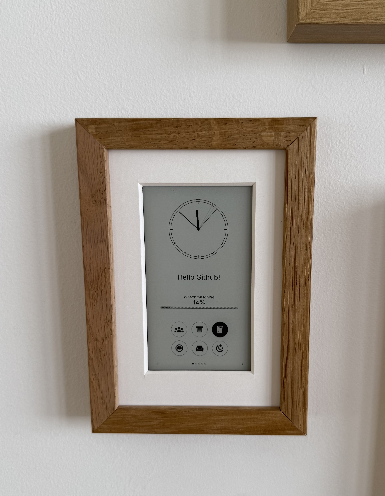

# E-Ink HASS Frame

Turn an M5PaperS3 into a wall-mounted e-ink dashboard for Home Assistant.

E-Ink HASS Frame is a Home Assistant add-on for configuring, building, and
flashing dashboards for the M5PaperS3. It is designed for displays that live in
your home and stay plugged in, for example in a picture frame on the wall. It is
not optimized for long battery life or deep sleep use.





## What It Does

The add-on gives you a browser-based control page where you can design the pages
shown on the e-ink display, connect them to Home Assistant entities, build the
firmware, and update the device over the air. A live preview helps you setting up the pages for your liking.

Supported page types:

- Overview page
- Weather page
- Player page
- Custom pages with widgets

Supported custom widgets:

- Switch
- Progress bar
- Slider
- Thermostat
- Text
- Clocks
- Weather widgets

The display can also be controlled through MQTT. You can switch pages, toggle
dark mode, expose MQTT text widgets, and publish device status such as battery
level, plug status, current page, availability, and MQTT connection state.

## Install In Home Assistant

Install it as a custom Home Assistant add-on repository:

[](https://my.home-assistant.io/redirect/supervisor_add_addon_repository/?repository_url=https%3A%2F%2Fgithub.com%2Fholnburger%2Feink-hass-frame)

1. Open Home Assistant.
2. Go to **Settings** -> **Add-ons** -> **Add-on Store**.
3. Open the three-dot menu and choose **Repositories**.
4. Add this repository URL:

   ```text
   https://github.com/holnburger/eink-hass-frame
   ```

5. Install **E-Ink HASS Frame** from the add-on store.
6. Start the add-on and open it from the Home Assistant sidebar or add-on page.

The add-on runs inside Home Assistant and can browse your Home Assistant
entities through the Supervisor connection. For firmware builds, set the
device-facing Home Assistant URL and long-lived access token in the add-on
configuration, because the M5PaperS3 itself needs a LAN-reachable address.

This add on doesn't need to run constantly. You only need this to set up and configure your device, you can shut it down afterwards.

## First Flash

The first flash must be done over USB from a browser. This project uses Web
Serial, so browser flashing only works in Chrome and Edge.

Inside the add-on:

1. Configure your pages and Home Assistant bindings.
2. Build the firmware.
3. Connect the M5PaperS3 over USB.
4. Use the browser flashing flow to install the firmware.
5. Connect the M5PaperS3 to your wifi during the setup.
6. Optional: Visit the device to configure your MQTT connection to Home Assistant
6. Finish the setup and save the device for future updates.

After the first USB flash, OTA updates are possible from the same control page.
You can rebuild the firmware and upload it to the device over the network.
Important: You don't need to run this add on constantly. This add on is just needed to configure your device.

## Run Outside Home Assistant

You can also run E-Ink HASS Frame as a Docker container on another computer.

```bash
docker compose up -d
```

Then open:

```text
http://localhost:3000
```

When running outside Home Assistant, enter your Home Assistant base URL and a
long-lived access token in the app so it can search entities and build firmware
with the right device configuration.

## MQTT Control

MQTT is configured directly on the M5PaperS3 after it is online. Home Assistant
discovery can expose controls and sensors automatically.

MQTT can be used to:

- Change to a specific page
- Go to the another page on the device (drop down)
- Toggle dark mode
- Update exposed text widgets
- Report battery level
- Report whether the device is plugged in
- Report the current page
- Report availability and MQTT status

## Notes 

This project is vibe coded (Codex) and experimental. It is mainly build because I wanted a pleasant picture like dashboard. It is NOT a polished commercial firmware. There IS spaghetti code.

The intended setup is:

- M5PaperS3
- Always plugged in
- Home Assistant
- Optional MQTT broker
- Chrome or Edge for the first USB flash

I started this because I was heavily inspired by the e-ink remote that I saw in this [reddit thread](https://www.reddit.com/r/homeassistant/comments/1qs0q11/eink_remote_for_home_assistant/). This project is heavily relying on the [FastEPD](https://github.com/bitbank2/FastEPD) project by bitbank2. Thank you for your work!